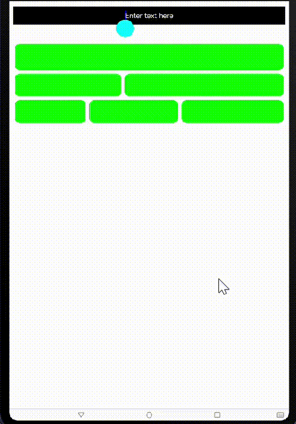

# SizeAdjustingTextView

This is based on an open source autosizing text component for Hmos.

## Source

Inspired by [erchenger/SizeAdjustingTextView](https://github.com/erchenger/SizeAdjustingTextView)

## Feature
SizeAdjustingTextView is a library that allows user to input text of any length of characters which will auto resize the text within the custom component.
Resizing multiple lines in the text component to keep up the changes.



## Dependency
1. For using sizeadjustingtextview module in sample app, include the source code and add the below dependencies in entry/build.gradle to generate hap/support.har.
```groovy
    dependencies {
       implementation fileTree(dir: 'libs', include: ['*.jar', '*.har'])
       implementation project(path: ':sizeadjustingtextview')
       testImplementation 'junit:junit:4.13'
       ohosTestImplementation 'com.huawei.ohos.testkit:runner:1.0.0.100'
}
```
2. For using sizeadjustingtextview in separate application using har file, add the har file in the entry/libs folder and add the dependencies in entry/build.gradle file.
```groovy
        dependencies {
             implementation fileTree(dir: 'libs', include: ['*.har'])
             testImplementation 'junit:junit:4.13'
        }
```
3. For using sizeadjustingtextview from a remote repository in separate application, add the below dependencies in entry/build.gradle file.
``` groovy
         dependencies {
             implementation 'dev.applibgroup:SizeAdjustingTextView'
             testCompile 'junit:junit:4.13'
         }
```

## Usage

#### In code
```
XML: 
<com.omitneedlesscode.sizeadjustingtextview.SizeAdjustingTextView
        ohos:id="$+id:topBox"
        ohos:height="75vp"
        ohos:width="match_parent"
        ohos:background_element="#EE00FF"
        ohos:below="$id:text_input"
        ohos:multiple_lines="true"
        ohos:padding="0vp"
        ohos:text_alignment="center"
        ohos:text_color="#000000"
        ohos:text_size="32fp"/>

JAVA:
        SizeAdjustingTextView mTopMessageBox = (SizeAdjustingTextView) findComponentById(ResourceTable.Id_topBox);
        TextMover.moveTextFromCellToCell(mBottomMiddleBox, mBottomRightBox);

```
